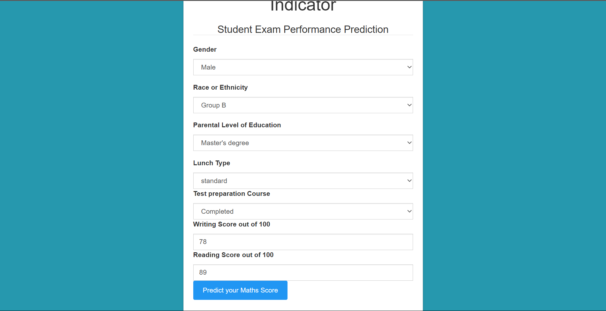
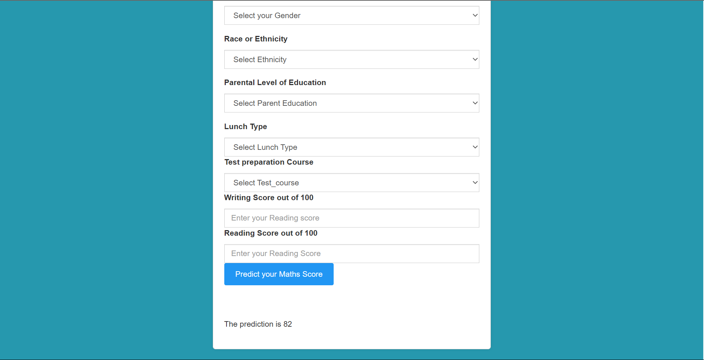

# Student Performance Indicator Project:

This project aims to develop a student performance indicator that predicts a student's math score based on various user inputs. The project utilizes machine learning techniques to predict math scores using features such as writing score, reading score, parental education, ethnicity, gender, and group membership. The project also investigates the correlations and causal relationships between these variables and math outcomes, ultimately estimating the math score based on these factors.

#Features:
*`Writing Score`: This feature represents a student's score in a writing exam.
*`Reading Score`: This feature represents a student's score in a reading exam.
*`Parental Education`: This feature represents the education level of a student's parents.
*`Ethnicity`: This feature represents a student's ethnicity.
*`Gender`: This feature represents a student's gender.
*`Group Membership`: This feature represents the group that the student belongs to.
Target variable:
* `Math Score`: Price of the given Diamond.
Machine Learning Techniques
The machine learning techniques used in this project include regression analysis and causal inference techniques. Regression analysis is used to predict math scores based on the various features, while causal inference techniques are used to identify the causal relationships between the features and math outcomes.

# Screenshot of UI

# Approach for the project 

1. Data Ingestion : 
    * In Data Ingestion phase the data is first read as csv. 
    * Then the data is split into training and testing and saved as csv file.

2. Data Transformation : 
    * In this phase a ColumnTransformer Pipeline is created.
    * for Numeric Variables first SimpleImputer is applied with strategy median , then Standard Scaling is performed on numeric data.
    * for Categorical Variables SimpleImputer is applied with most frequent strategy, then ordinal encoding performed , after this data is scaled with Standard Scaler.
    * This preprocessor is saved as pickle file.

3. Model Training : 
    * In this phase base model is tested . The best model found was catboost regressor.
    * After this hyperparameter tuning is performed on catboost and knn model.
    * A final VotingRegressor is created which will combine prediction of catboost, xgboost and knn models.
    * This model is saved as pickle file.

4. Prediction Pipeline : 
    * This pipeline converts given data into dataframe and has various functions to load pickle files and predict the final results in python.

5. Flask App creation : 
    * Flask app is created with User Interface to predict the gemstone prices inside a Web Application.

# Exploratory Data Analysis Notebook
Link : [EDA Notebook](./notebook/eda.ipynb)

#Dependencies
Python 3.8 or higher
pandas
numpy
seaborn
scikit-learn
matplotlib
xgboost
catboost
dill
Flask
Please make sure to install these dependencies using pip or any other package manager before running the project.
Usage
Install the required dependencies using pip install pandas numpy scikit-learn.
Clone the repository using git clone https://github.com/AnshulDubey1/MachineLearningProject.git.
Navigate to the project directory using cd <MachineLearningProject>.
Run the student_performance_indicator.py script using python student_performance_indicator.py.
Follow the prompts and input the required user inputs.
The program will output the predicted math score for the student based on the input features.
Conclusion
The student performance indicator project aims to predict math scores based on various user inputs, including writing score, reading score, parental education, ethnicity, gender, and group membership. The project utilizes machine learning techniques to predict math scores and investigate the correlations and causal relationships between the features and math outcomes. This project can be used by educators and institutions to identify factors that may impact a student's math performance and take appropriate measures to support their success.
